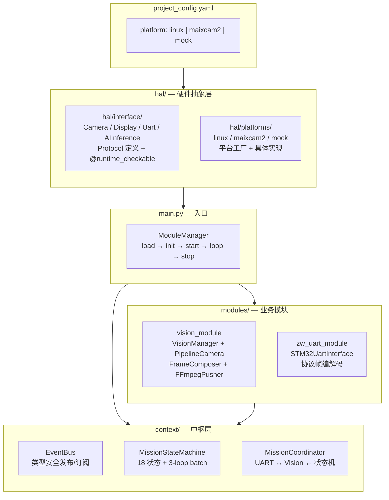
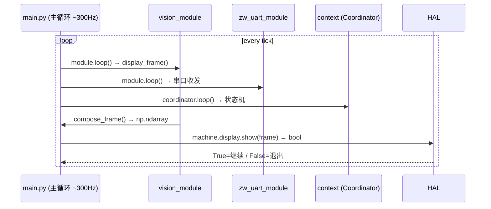
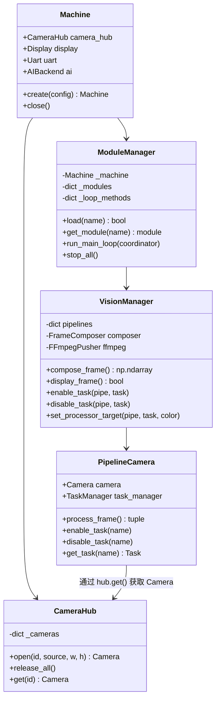
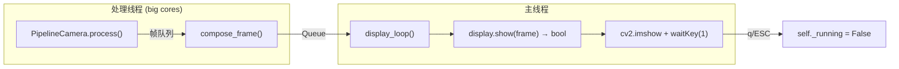
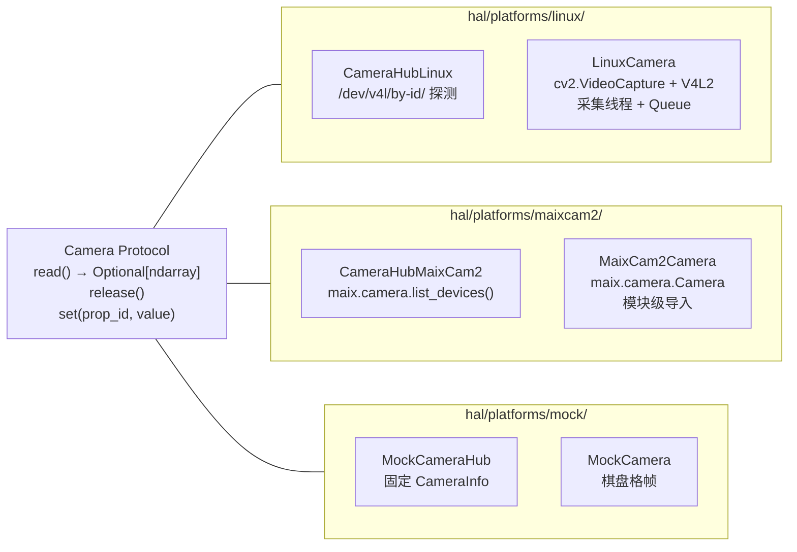
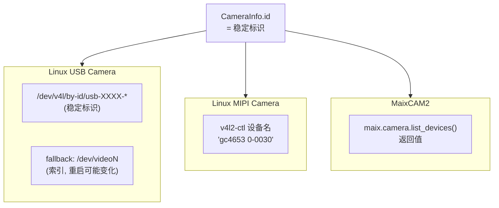

# HAL 架构概览

## 分层架构



## 数据流



## Machine 与 ModuleManager 分立



## Display 主线程约束



## 各平台 Camera 实现



## 设备标识策略



## 第一阶段实施范围

```mermaid
gantt
    title Phase 1 — HAL 骨架
    dateFormat  YYYY-MM-DD
    section Round 1
    hal/interface/             :a1, 1d
    hal/platforms/linux/       :a2, 1d
    hal/platforms/maixcam2/    :a3, 0.5d
    hal/platforms/mock/        :a4, 0.5d
    hal/__init__.py + project_config :a5, 0.5d
    section Round 2
    ModuleManager + main.py    :b1, 1d
    VisionManager + PipelineCamera :b2, 2d
    CameraHub (单例)           :b3, 0.5d
    UART 模块适配              :b4, 1d
    mission_context 桥接       :b5, 0.5d
    section Round 3
    重命名 zw_opencv_module → vision_module :c1, 1d
    更新所有 15+ import       :c2, 0.5d
```
