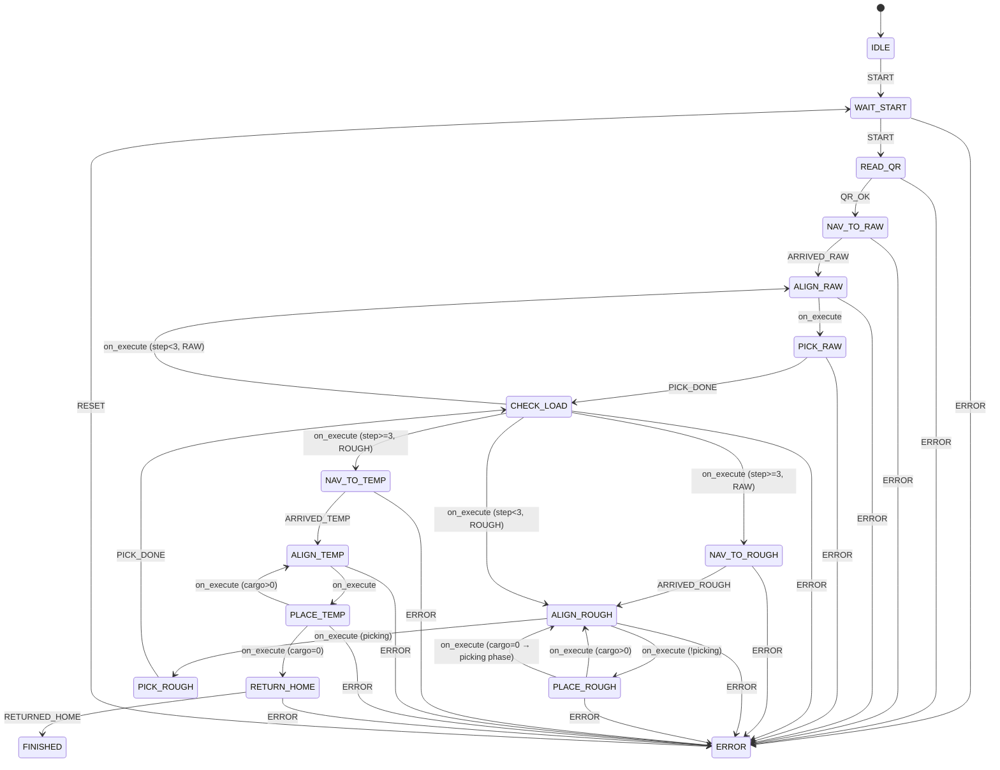

# 统一状态机设计

> 适用项目：Zulu-Walker（Orange Pi 5B + STM32）
> 用途：香橙派（视觉/决策）与 STM32（运动/执行）的双层状态机协同规范

---

## 1. 架构总览

```
┌───────────────────────────────────────────────────────┐
│                   Orange Pi (OP)                        │
│                                                         │
│  ┌────────────────┐     ┌───────────────────────────┐  │
│  │ MissionSM (镜像) │◄───►│      VisualSM (主控)      │  │
│  │  27 states      │     │  IDLE/SEARCH/TRACKING/    │  │
│  │                 │     │  RECOVERY/FAIL            │  │
│  └───────┬─────────┘     └───────────────────────────┘  │
│          │                                                │
│          │ UART 帧 (0x10~0x18)                            │
└──────────┼────────────────────────────────────────────┘
           │
┌──────────┼────────────────────────────────────────────┐
│          ▼                                                │
│                   STM32 (MCU)                             │
│  ┌────────────────┐     ┌───────────────────────────┐  │
│  │ MissionSM (主控) │     │    VisualSM (镜像)         │  │
│  │  27 states      │     │   (心跳中的 visual_state)  │  │
│  └────────────────┘     └───────────────────────────┘  │
│                                                         │
└───────────────────────────────────────────────────────┘
```

### 职责划分

| 角色 | MissionSM | VisualSM |
|------|-----------|----------|
| **STM32** | 主控 — 任务流推进、导航、执行机构 | 镜像 — 通过 `HEARTBEAT` 中 `visual_state` 了解视觉状态 |
| **Orange Pi** | 镜像 — 接收 MCU 事件同步状态 | 主控 — 视觉任务启停、检测结果、伺服数据 |

### 核心原则

1. **STM32 是 MissionSM 的主控** — 它知道走到哪里了、执行机构是否完成
2. **Orange Pi 是 VisualSM 的主控** — 它决定何时找到目标、何时可放置、切换什么视觉任务
3. **双方都维护一份 MissionSM 镜像** — 通过 UART 帧同步
4. **任何一方发现危险都可以切 ERROR**

---

## 2. 关键设计：区域自动控制

### 设计决策

视觉任务的启停 **不由 MCU 通过 CMD 控制**，而是由 OP 监听 MissionSM 状态变化自动管理。MCU 只需要通过 `TYPE_ARRIVED` 告知 OP 当前所处区域。

```
MCU 到达 RAW 区 → 发 TYPE_ARRIVED zone=2
OP 收到 → MissionSM 切换到 ALIGN_RAW
OP 自动检测到状态变化 → 开启 track_cargo
OP 从 batch_order[current_step] 获取颜色 → 传给 processor
```

### 状态→视觉任务映射表

| Mission 状态 | 自动启用的视觉任务 | 颜色来源 | 说明 |
|---|---|---|---|
| `READ_QR` | `qr_detect` | 无 | 二维码解码 |
| `ALIGN_RAW` | `track_cargo` | `batch_order[current_step]` | 取料时追踪货物 |
| `PICK_RAW` | `track_cargo`（保留） | 同上 | 确认货物在夹爪中心 |
| `ALIGN_ROUGH` | `ring_track` | `batch_order[current_step]` | 放料时对齐色环 |
| `ALIGN_TEMP` | `ring_track` | `batch_order[current_step]` | 暂存区对齐色环 |
| 其他状态 | 无（关闭所有视觉任务） | - | - |

### 对 MCU 的电控对接约定

> **MCU 不需要发送任何 CMD 来开启或关闭视觉任务。**
>
> OP 会在收到 `TYPE_ARRIVED` 后自动推进 MissionSM，检测到状态变化后自动启用对应的视觉任务。目标颜色由 OP 从 `batch_order` 中自动获取——该 `batch_order` 由 OP 在 QR 解析后通过 `STATUS_FROM_VISION` 同步给 MCU。
>
> MCU 只需做三件事：
> 1. 到达区域后发 `TYPE_ARRIVED zone_id`
> 2. 动作完成后发 `ACTION_DONE action_id`
> 3. 定期发/收 `HEARTBEAT` 保持同步

### 颜色同步机制

`batch_order` 由双方共同维护：

```
OP 解析 QR "123+231"
  → batch_order = [Color.RED, Color.GREEN, Color.BLUE]
  → 通过 STATUS_FROM_VISION 发回 MCU（QR_RESULT 帧）

每次 pick 成功后
  → current_step += 1
  → 下次 status 帧中携带新的 cargo_count 和 mission_state

MCU 通过 STATUS_FROM_VISION 同步获得 cargo_count 和当前状态
→ 自行推导当前 target_color = batch_order[cargo_count - 1]
```

> **注**：颜色信息不需要额外的 CMD 帧来传递。MCU 通过维护一个与 OP 同步的 `batch_order` 列表 + `cargo_count` 即可推导出当前目标颜色。

---

## 3. MissionStateMachine

### 状态列表（27 状态，须与 STM32 固件同步）

| ID | 名称 | 含义 |
|----|------|------|
| 0 | `IDLE` | 上电初始化 |
| 1 | `WAIT_START` | 一键启动前就绪 |
| 2 | `READ_QR` | 读取二维码 |
| 3 | `NAV_TO_RAW` | 前往原料区 |
| 4 | `ALIGN_RAW` | 原料区对准 |
| 5 | `PICK_RAW` | 抓取物料 |
| 6 | `CHECK_LOAD` | 确认已装载 |
| 7 | `NAV_TO_ROUGH` | 前往粗加工区 |
| 8 | `ALIGN_ROUGH` | 粗加工区对准色环 |
| 9 | `PLACE_ROUGH` | 放置物料 |
| 10 | `NAV_TO_TEMP` | 前往暂存区 |
| 11 | `ALIGN_TEMP` | 暂存区对准色环 |
| 12 | `PLACE_TEMP` | 放置/码垛物料 |
| 13~22 | 第二批状态 | 参数化处理，见批次逻辑 |
| 23 | `RETURN_HOME` | 返回启停区 |
| 24 | `FINISHED` | 任务完成 |
| 25 | `ERROR` | 异常 |
| **26** | **`PICK_ROUGH`** | **粗加工区取回物料（放完后重新捡起）** |

### 事件列表

| 事件 | 触发者 | 用途 |
|---|---|---|
| `START` | MCU (`TYPE_CMD_FROM_MCU CMD_START_QR`) | IDLE → WAIT_START → READ_QR |
| `QR_OK` | OP (QR 解码成功) | READ_QR → NAV_TO_RAW |
| `ARRIVED_RAW` | MCU (`TYPE_ARRIVED zone=RAW`) | NAV_TO_RAW → ALIGN_RAW |
| `READY_TO_PICK` | OP (`STATUS_FROM_VISION flags`) | ALIGN_RAW → PICK_RAW |
| `PICK_DONE` | MCU (`ACTION_DONE action_id=1`) | PICK_RAW → CHECK_LOAD |
| `LOAD_CONFIRMED` | OP/传感器 | CHECK_LOAD → NAV_TO_ROUGH |
| `ARRIVED_ROUGH` | MCU (`TYPE_ARRIVED zone=ROUGH`) | NAV_TO_ROUGH → ALIGN_ROUGH |
| `READY_TO_PLACE` | OP (`STATUS_FROM_VISION flags`) | ALIGN_ROUGH → PLACE_ROUGH |
| `PLACE_DONE` | MCU (`ACTION_DONE action_id=2/3`) | PLACE_* → 下一状态 |
| `ARRIVED_TEMP` | MCU (`TYPE_ARRIVED zone=TEMP`) | NAV_TO_TEMP → ALIGN_TEMP |
| `ALL_PLACED` | OP/Coordinator | 批次完成 |
| `RETURNED_HOME` | MCU (`TYPE_ARRIVED zone=START`) | RETURN_HOME → FINISHED |
| `RESET` | MCU/OP | ERROR → WAIT_START |
| `ERROR` | MCU/OP | 任何状态 → ERROR |

### 转换图



### 批次逻辑与混合事件模型

状态机采用**混合模型**：MCU 触发的事件（`ARRIVED_*`、`ACTION_DONE`）使用事件驱动即时转换；
内部决策（`ready_to_pick`、`cargo_count`、`picking_from_rough`）通过 `on_execute` 在 `update()` 中处理。

**完整一次 batch 的状态链**：

```
RAW 区:
  ALIGN_RAW → PICK_RAW → CHECK_LOAD [×3]
  cargo_count: 0→1→2→3, current_step: 0→1→2
  → NAV_TO_ROUGH (step=0 重置)

ROUGH 区 — 放料阶段 (picking_from_rough=False):
  ALIGN_ROUGH → PLACE_ROUGH [×3]
  cargo_count: 3→2→1→0
  放完后 → ALIGN_ROUGH (picking_from_rough=True, step=0 重置)

ROUGH 区 — 取料阶段 (picking_from_rough=True):
  ALIGN_ROUGH → PICK_ROUGH → CHECK_LOAD [×3]
  cargo_count: 0→1→2→3, current_step: 0→1→2
  取完后 → NAV_TO_TEMP (picking_from_rough=False, step=0 重置)

TEMP 区:
  ALIGN_TEMP → PLACE_TEMP [×3]
  cargo_count: 3→2→1→0
  → RETURN_HOME → FINISHED
```

**`on_execute` 决策逻辑**：

| State | 条件 | 下一步 |
|---|---|---|
| `_AlignRawState` | `ready_to_pick && !color_mismatch` | `PICK_RAW` |
| `_AlignRoughState` | `picking_from_rough && ready_to_pick` | `PICK_ROUGH` |
| `_AlignRoughState` | `!picking_from_rough && ready_to_place` | `PLACE_ROUGH` |
| `_AlignTempState` | `ready_to_place` | `PLACE_TEMP` |
| `_CheckLoadState` | `zone=RAW, step<3` | `ALIGN_RAW` |
| `_CheckLoadState` | `zone=RAW, step>=3` | `NAV_TO_ROUGH` |
| `_CheckLoadState` | `zone=ROUGH, step<3` | `ALIGN_ROUGH` |
| `_CheckLoadState` | `zone=ROUGH, step>=3` | `NAV_TO_TEMP` |
| `_PlaceRoughState` | `place_action_done && cargo>0` | `ALIGN_ROUGH` |
| `_PlaceRoughState` | `place_action_done && cargo==0` | `ALIGN_ROUGH (picking=True)` |
| `_PlaceTempState` | `place_action_done && cargo>0` | `ALIGN_TEMP` |
| `_PlaceTempState` | `place_action_done && cargo==0` | `RETURN_HOME` |

**`update()` 调用时机**（在 `MissionCoordinator` 中）：

每次外部事件处理后立即调 `mission_sm.update()`，确保 `on_execute` 及时检查状态。

```python
# 每个事件处理器末尾
self.mission_sm.on_arrived(zone_id)
self.mission_sm.update()

self.mission_sm.on_action_done(action_id, result)
self.mission_sm.update()
```

---

## 4. VisualStateMachine

### 状态

| 状态 | 含义 |
|---|---|
| `IDLE` | 待机，无视觉任务运行 |
| `SEARCH` | 全局搜索目标 |
| `TRACKING` | 找到目标，输出伺服偏差 |
| `RECOVERY` | 跟踪丢失，扩大搜索（当前未启用） |
| `FAIL` | 视觉异常终止 |

### 事件与转换

```
IDLE → SEARCH: START
SEARCH → TRACKING: TARGET_FOUND（连续 10 帧检测到）
SEARCH → FAIL: SEARCH_TIMEOUT
TRACKING → SEARCH: TARGET_LOST（连续 5 帧丢失）
任意 → IDLE: STOP
FAIL → IDLE: RESET
```

---

## 5. Cargo 数据流

```
MissionCoordinator.__init__
  → ctx.cargo_set = CargoSet.create_standard()  # 6 个 CargoItem

QR 解析完成
  → ctx.batch_order = [Color.RED, Color.GREEN, Color.BLUE]
  → ctx.current_batch = 1
  → ctx.current_step = 0

进入 ALIGN_RAW
  → ctx.target_color = ctx.batch_order[ctx.current_step]
  → item = ctx.cargo_set.get_by_color(target_color, batch)[0]

PICK 成功
  → item.pick()           # available=False, zone=ON_ROBOT
  → ctx.cargo_count += 1

PLACE 成功
  → item.place(zone)      # zone=ROUGH/TEMP
  → ctx.cargo_count -= 1
  → ctx.current_step += 1

批次完成
  → ctx.current_step = 0
  → ctx.current_batch += 1
  → ctx.batch_order = 来自 QR 的第二批顺序

全部完成 / RESET
  → ctx.cargo_set.reset_all()
```

---

## 6. 错误与恢复

| 错误场景 | 处理方式 |
|---|---|
| 视觉连续丢失 5 帧 | TARGET_LOST → SEARCH，重置伺服数据 |
| 视觉超时（3s 无检测结果） | VISUAL_FAIL → ERROR |
| 颜色不匹配 | COLOR_MISMATCH 标志位上报，不切 ERROR |
| 心跳丢失 3 次（300ms） | ERROR，停车 |
| CMD_STOP_VISUAL | 关闭所有视觉任务，VisualSM → IDLE |

---

## 版本历史

| 版本 | 日期 | 变更 |
|---|---|---|
| **v1.0** | 2026-07-04 | 初始化：确定区域自动控制设计，定义状态↔任务映射表 |
