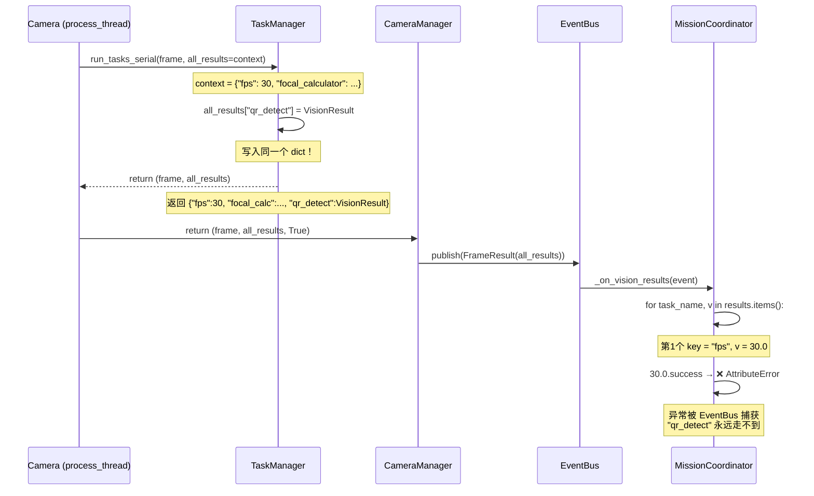
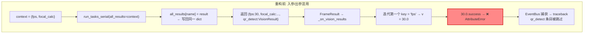
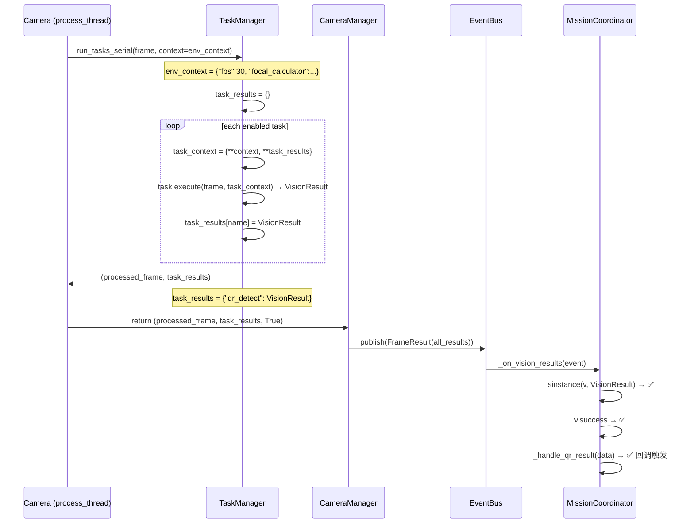

# 视觉数据流坑记：FrameResult 回调不触发

> 最后更新: 2026-07-17
> ⚠️ **历史文档说明**：本文记载的 `FrameResult` → `_on_vision_results` 回调路径是**重构前的历史路径**。
> 当前架构已改为 `_pending_results` deque 传递视觉结果，`MissionCoordinator` 不再订阅 `FrameResult` 事件。
> 详见 `docs/architecture/thread_tick_topology.md` §3-4。
>
> 现象: QRCodeProcessor 正常返回 VisionResult，但 `_on_vision_results` → `_handle_qr_result` 回调链无反应，控制台持续输出 `AttributeError: 'float' object has no attribute 'success'`

---

## 1. 现象描述

- QRCodeProcessor 检测到二维码，`process()` 返回 `VisionResult(success=True, result_data={...})`
- Camera 处理线程的 `_result_callbacks` 能收到结果
- 但 `_on_vision_results` → `_handle_qr_result` → `_on_qr_result_event` 整条回调链不触发
- 控制台每帧输出 `AttributeError: 'float' object has no attribute 'success'`
- 心跳包通信正常，排除 UART 硬件问题

---

## 2. 根因：入参/出参 dict 混用

### 2.1 完整时序（重构前）

### 2.2 问题分析

`TaskManager.run_tasks_serial` 的参数 `all_results` 同时承担了两个角色：

| 条目 | 来源 | 实际类型 | 语义角色 |
|------|------|---------|---------|
| `"fps"` | 调用方传入 | `float` | 运行时上下文 |
| `"focal_calculator"` | 调用方传入 | `object` | 运行时上下文 |
| `"qr_detect"` | task 执行结果 | `VisionResult` | 任务输出 |

Python dict 保留插入顺序。`"fps"` 在 `"qr_detect"` 之前插入，所以 `_on_vision_results` 先迭代到 `fps: 30.0`，访问 `30.0.success` 立即炸 AttributeError，`"qr_detect"` 的条目永远走不到。

---

## 3. 修复方案：context 只读 + task_results 独立

### 3.1 修复后时序

### 3.2 方案图解

```mermaid
flowchart TD
    subgraph "重构后: context 只读 + task_results 独立"
        B1["env_context = {fps, focal_calc}"] --> B2["run_tasks_serial(context=env_context)"]
        B2 --> B3["task_results: Dict[str, VisionResult] = {}<br/>← 全新 dict，不入参 context"]
        B3 --> B4["每 task: {**context, **task_results} 合并快照<br/>context 原对象不被修改"]
        B4 --> B5["task_results[name] = VisionResult ← 写入独立 dict"]
        B5 --> B6["返回 (processed_frame, task_results)<br/>↑ task_results 纯 VisionResult"]
        B6 --> B7["FrameResult(all_results)"]
        B7 --> B8["_on_vision_results 迭代"]
        B8 --> B9["isinstance(v, VisionResult) → ✅"]
        B9 --> B10["v.success → ✅ → 回调正常触发"]
    end

    style B9 fill:#8f8,stroke:#090,stroke-width:2
    style B10 fill:#cfc,stroke:#090
```

### 3.3 修改的文件

| 文件 | 改动 |
|------|------|
| `task_manager.py:104-152` | `run_tasks_serial` 签名 `all_results` → `context`；内部建独立 `task_results` dict；返回纯 VisionResult 结果 |
| `vision_manager.py:253-265` | `Camera.process_frame()` 拆包 `(processed_frame, task_results)` |
| `mission_context.py:31,377-388` | 加 `VisionResult` import + `isinstance` 守卫；`_on_vision_results` 已重构为 `_process_vision_results`，从 `drain_results()` 消费而非 EventBus `FrameResult` |

### 3.4 关键设计决策

1. **为什么不用 `try/except` 掩盖？** — 每帧 1 次 `traceback.print_exc()` 有性能损耗，且掩盖 root cause。
2. **为什么不用 `hasattr`？** — `hasattr(v, 'success')` 会静默接受任何带 success 的非法对象；`isinstance` 更精确，与代码库已有风格一致（多处使用 `isinstance(processor, ColorTrackable)`）。
3. **inter-task 通信如何保证？** — `{**context, **task_results}` 每 task 合并快照，前置 task 结果对后续 task 可见，且不污染原始 context。

---

## 4. 修复后数据流契约

| 边界 | 数据结构 | 保证 |
|------|---------|------|
| `run_tasks_serial` 返回 | `Tuple[ndarray, Dict[str, VisionResult]]` | 只含 VisionResult |
| `Camera.process_frame()` 返回 | `Tuple[ndarray, Dict[str, VisionResult], bool]` | 同上游 |
| `CameraManager.process_all()` 返回 | `Tuple[ndarray, Dict[str, Dict[str, VisionResult]], bool]` | 每 camera 的子 dict 纯 VisionResult |
| `FrameResult.all_results` | `Dict[str, Dict[str, VisionResult]]` | 与 type annotation 一致 |
| `_on_vision_results` 消费 | `VisionResult` 迭代 | `isinstance` 兜底 |

所有类型注解现在与实际运行时类型一致。

> **当前架构变更** (2026-07 重构后):
> - `CameraManager.process_all()` 返回的结果不再通过 `EventBus.publish(FrameResult)` 分发
> - 改为 `VisionManager._pending_results` deque → 主线程 `coordinator.loop()` → `drain_results()`
> - `_on_vision_results` 已被移除，替代为 `_process_vision_results`
> - 详见 `thread_tick_topology.md` §3-4
